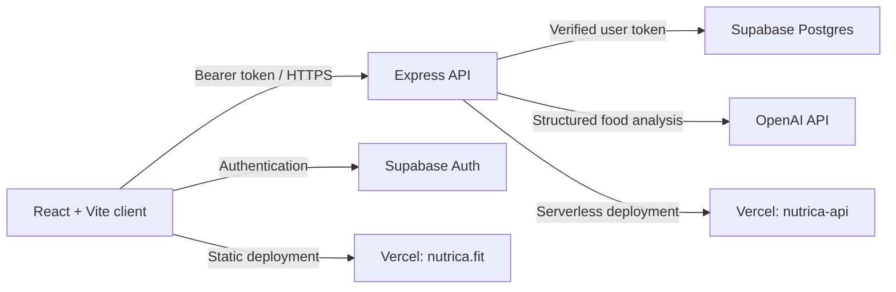

# Nutrica

**AI-assisted nutrition tracking that turns everyday meal logging into a rewarding pixel-art collection.**

[Live application](https://nutrica.fit) · [Architecture](docs/ARCHITECTURE.md) · [Security](SECURITY.md)

Nutrica is a full-stack web application for logging meals, understanding macronutrients, and building healthier habits. Users can describe a meal or scan a nutrition label; the application uses OpenAI to structure the nutrition data, stores records behind Supabase authentication, and visualizes progress through a collectible puzzle system.

## Highlights

- AI-assisted meal description and nutrition-label analysis, with server-side API credentials.
- Supabase authentication, protected routes, password recovery, and per-user data access.
- Daily calorie and macronutrient tracking with personalized goals.
- Gamified, shareable pixel-art puzzle collections.
- Responsive mobile and desktop UI, accessible dialogs, keyboard navigation, and safe viewport behavior.
- Input validation, rate limiting, CORS allowlists, security headers, and health checks.

## Architecture



The browser only receives public Supabase configuration. OpenAI and Supabase service-role credentials remain on the API service.

## Tech stack

| Area | Technology |
| --- | --- |
| Client | React 19, Vite, React Router, CSS Modules |
| API | Node.js, Express, Helmet, express-rate-limit, Multer |
| Data & auth | Supabase |
| AI | OpenAI `gpt-4.1-mini` |
| Hosting | Vercel |
| Tests | Jest, Supertest |

## Repository layout

```text
.
├── frontend/                  # React single-page application
│   ├── src/components/        # Reusable UI by domain
│   ├── src/pages/             # Route-level features and modals
│   ├── src/utils/             # API, media, nutrition, and puzzle utilities
│   └── public/                # Static brand and product assets
├── backend/                   # Express API service
│   └── src/
│       ├── config/            # Runtime configuration
│       ├── middleware/        # Auth, errors, logging, performance
│       ├── routes/            # HTTP endpoints
│       └── services/          # OpenAI and database boundaries
├── docs/                      # Architecture and operational notes
└── .github/workflows/         # Continuous integration
```

## Local development

### Prerequisites

- Node.js 20 LTS or 22 LTS (the repository pins Node 20 for CI).
- A Supabase project and an OpenAI API key for end-to-end AI features.

### 1. Configure environment variables

```bash
cp frontend/.env.example frontend/.env.local
cp backend/.env.example backend/.env
```

Fill in the placeholders. Never put `OPENAI_API_KEY` or `SUPABASE_SERVICE_ROLE_KEY` in `frontend/.env.local`: any variable starting with `VITE_` is shipped to the browser.

For local development, set `CORS_ORIGIN=http://localhost:5173` in `backend/.env` and set `VITE_API_BASE_URL=http://localhost:3001` in `frontend/.env.local`.

### 2. Install and run

```bash
npm --prefix frontend ci
npm --prefix backend ci

# Terminal 1
npm run dev:api

# Terminal 2
npm run dev:web
```

The client is served at `http://localhost:5173`; the API listens on `http://localhost:3001`.

## Quality checks

```bash
npm run build     # production client build
npm test          # API contract and validation tests
npm run verify    # both commands above
npm run audit     # production dependency audit
```

GitHub Actions runs the client build and backend test suite on every push and pull request.

## Deployment

The frontend and API are separate Vercel projects. This isolates server credentials from the browser bundle.

1. Deploy `backend/` and configure the variables in [`backend/.env.example`](backend/.env.example). Set `CORS_ORIGIN` to `https://nutrica.fit` plus any approved preview origin.
2. Verify `https://<api-domain>/api/health` returns `{"success":true,"status":"ok"}`.
3. Deploy `frontend/` and configure [`frontend/.env.example`](frontend/.env.example), including the API URL without a trailing slash.
4. Assign `nutrica.fit` to the frontend project. Production routing proxies `/api/*` to the API service.

## Security and privacy

- All API writes require a verified Supabase bearer token.
- The API validates food and collection payloads before privileged persistence.
- CORS, Helmet, compression, request-size limits, and rate limits are enabled at the API boundary.
- Password recovery and account data are handled through Supabase.

Please report a vulnerability privately according to [SECURITY.md](SECURITY.md). Nutrica is a personal nutrition tracker, not medical advice.

## License

Released under the [MIT License](LICENSE).
